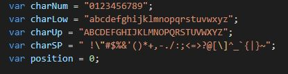

# Password Generator Starter Code

This is a website to help generating password with length between 8 to 128 characters. Password can include uppercase, lowercase, numeric, and/or special characters. If user's input is invalid, user needs to answer the same question again. My inital apporach is using ASCII Table so we can include all characters without declaring and taking space, but since user can choose password criteria, it is not effient to use ASCII Table when user decide to not use all characters. I finally decide to declare 4 strings representing each criteria. Depends on what criteria user choose, an empty string will add the representing string so it becomes a custom string to run the random character selection. This way makes my code shorter and easier to adjust when changing criteria.

## Built With
* HTML
* CSS
* Javascript

## Website
https://maggie9685.github.io/Password_Generator/

## Reference
https://developer.mozilla.org/

## License
Licensed under the MIT license.
